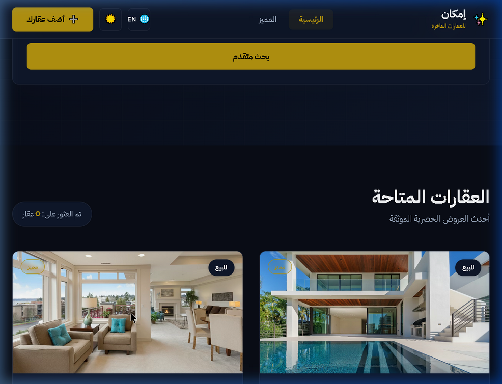
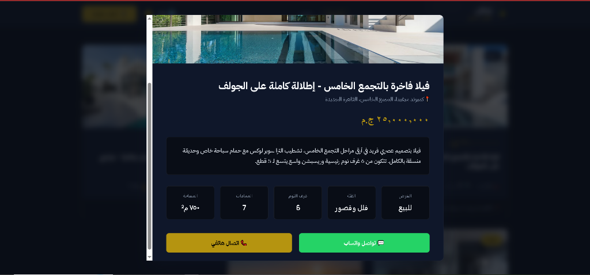

# EMKAN: Luxury Real Estate Marketplace 🏛️

> **"Redefining Digital Property Showcase for the Egyptian Elite."**
> A premium architectural platform designed and built by Ahmed Maamoun.

---

## 📸 The Experience

| Desktop Showcase | Mobile Ready |
| :--- | :--- |
|  |  |

---

## 🏛️ The Vision
EMKAN was built to serve as a bridge between high-end property developers and discerning clients in **New Cairo, Sheikh Zayed, and the North Coast**. I wanted to create a platform that feels as premium as the properties it lists. No generic templates—just bespoke, high-performance code.

---

## ✨ Key Pillars
*   **🌍 Cultural Intelligence:** Full RTL (Arabic) and LTR (English) support with dynamic typography that respects the aesthetic of each script.
*   **⚡ Speed-First Navigation:** Instant property filtering with zero-refresh transitions.
*   **🎨 Royal Design Tokens:** A curated Deep Navy and Gold palette designed specifically for 4K displays and Dark Mode enthusiasts.
*   **📞 Lead Generation:** Integrated WhatsApp and Call hooks to bridge the gap between interest and transaction.

---

## 🧠 Behind the Architecture: The "Bilingual" Challenge
Building a truly bilingual site is more than just translating text. The biggest challenge was handling the **Visual Balance** when switching from Arabic (RTL) to English (LTR).

**The Solution:** I developed a custom **Layout Direction Engine**. Instead of relying purely on `dir="rtl"`, I created a set of CSS variables and utility classes that dynamically adjust margins, paddings, and flex-directions based on the active language. This ensures that the "Royal" layout remains symmetrical and visually pleasing regardless of the script used.

---

## 🛠 Tech Blueprint
*   **Logic:** Node.js & TypeScript (for strict stability)
*   **UI:** Vanilla JavaScript (ES6+) & Custom CSS Design Tokens
*   **Server:** Express.js

---

## 🚦 Installation
```bash
npm install
npm run dev
```

---

## 👨‍💻 Get in Touch
**Ahmed Maamoun**
[LinkedIn](https://www.linkedin.com/in/ahmed-maamoun-41b181256/) | [GitHub](https://github.com/Maamoun0)

*Hand-crafted luxury, pixel by pixel.*
